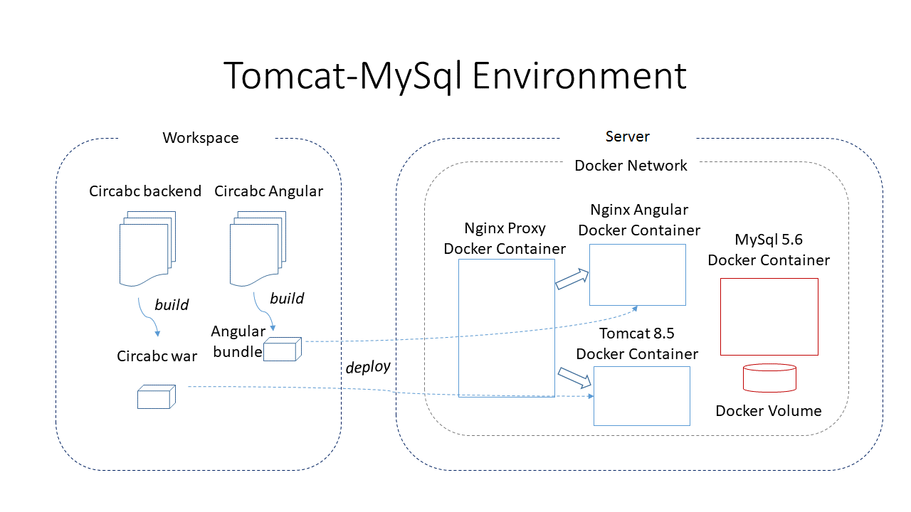
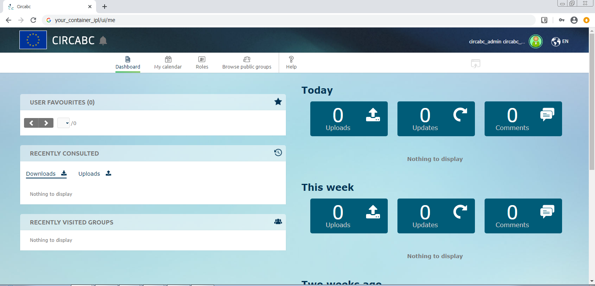
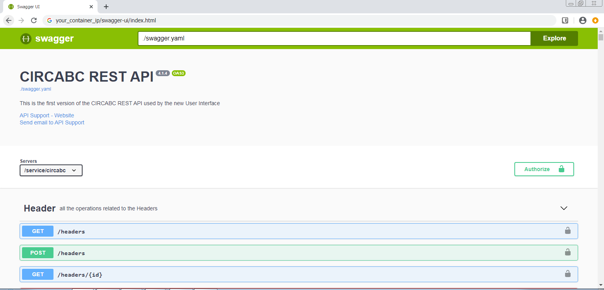
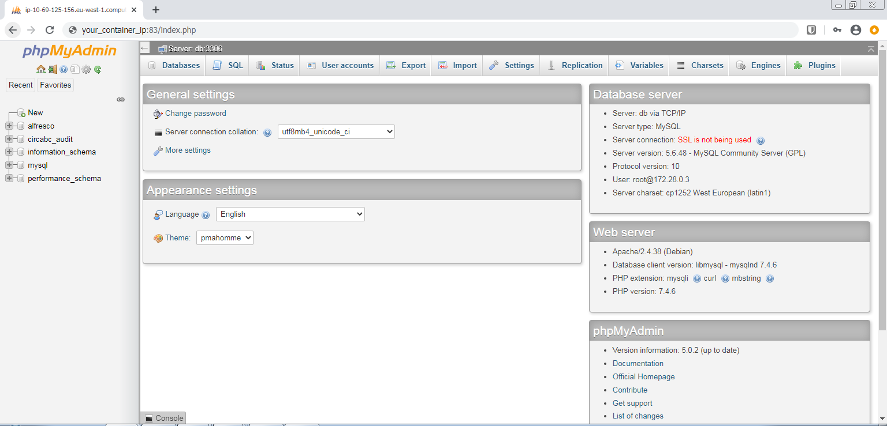

# CIRCABC 

## Building Circabc web application

### Prerequisites

- Install Java JDK 1.8+
    - set JAVA_HOME variable and add JAVA_HOME/bin to your PATH

- Install Maven
    - set M2_HOME variable and add M2_HOME/bin to your PATH

    - Edit M2_HOME/conf/settings.xml 

- Download and add alfresco.war to circabc-resources folder :    
    - Go to alfresco web site and download Alfresco 4.2.f community edition
 (https://hub.alfresco.com/t5/alfresco-content-services-hub/community-file-list-4-2-f/ba-p/289696)
    - Unzip the alfresco-community-4.2.f.zip archive
    - Copy the alfresco.war archive (located in web-server/webapps) to the circabc-resources folder

### Repository initialisation

Run a first mvn clean to add some missing libraries to your local repository :
``` 
mvn clean
```

### Build

Run to following command to build the entire Circabc application (frontend and backend) :

```
mvn clean package -Dbackend-target.env=tomcat-docker  -Dfrontend-target.env=docker -Dserver.node=N2
```

### Troubleshooting

- If you have permission denied error while building the frontend, check the npm executable inside circabc has exec rights.


## Deploying Circabc web application in docker environment

### Tomcat/MySql docker environment
The aim of this project is to provide an easy to install environment for OSS CIRCABC version.

- This environment contains the following containers :
   - Tomcat 8.5 Docker container running Circabc Web Application
   - MySQL 5.6 Database container
   - Angular Nginx container running Circabc Angular application
   - Reverse Proxy (Nginx) abstracting the connections to Circabc apps to avoid any Cors config.




Go to the `circabc` root folder and copy the artifacts to the docker dist folders. (Note that this step can be automated with your CD/CI tools)

Copy backend and fronted archives to the circabc-docker directories :

```
mkdir -p circabc-docker/tomcat/dist
mkdir -p circabc-docker/angular/dist
cp -f  circabc-backend/target/circabc.war circabc-docker/tomcat/dist/
cp -rf circabc-frontend/dist/circabc circabc-docker/angular/dist/
```

## Running Circabc web application in docker environment

Go to `circabc-docker` folder

Launch `docker-compose -f docker-compose-tomcat.yml up`

(you can used the `clean.sh` script to delete your environement)

## Using Circabc web application in docker environment

### Main Circabc web application
Connect to the exposed IP of the nginx container http://your_host_ip/ui/login 

You can connect with the following default credentials :
- Default Alfresco admin username/password are admin/password
- Default CircaBC admin userame/password are circabc_admin/password



### Swagger API
You can configure Circabc with the REST Api using the Swagger UI : http://your_host_ip/swagger-ui/index.html
Note that the Alfresco admin console is not avaiable in Alfresco OSS.



### Database administration
A MySql administration console is available in the docker environment.  
It is a PhpMyAdmin instance and can be accessed at the following url : http://your_host_ip:83/
with the following settings :
- Server : db
- Username : root
- Password : password



## Limitations ##
Warning :
 - This is an alpha release of a full open-source version of Circabc.  It has not been tested and is still under development.  Use only for test and evaluation.
 - Hazelcast has been removed.  An alternative cache should be implemented.
 -  Authentication not yet implemented, you can login with local Alfresco of Circab admin credentials here above.

## License ##
Copyright European Community - Licensed under the EUPL V.1.2
https://ec.europa.eu/isa2/solutions/european-union-public-licence-eupl_en

This Circabc version is entirely based on OSS libraries.  It does not rely on any Alfresco license.
Note that Hazelcast cache and other entreprise features of Alfresco have been disabled. 
 


