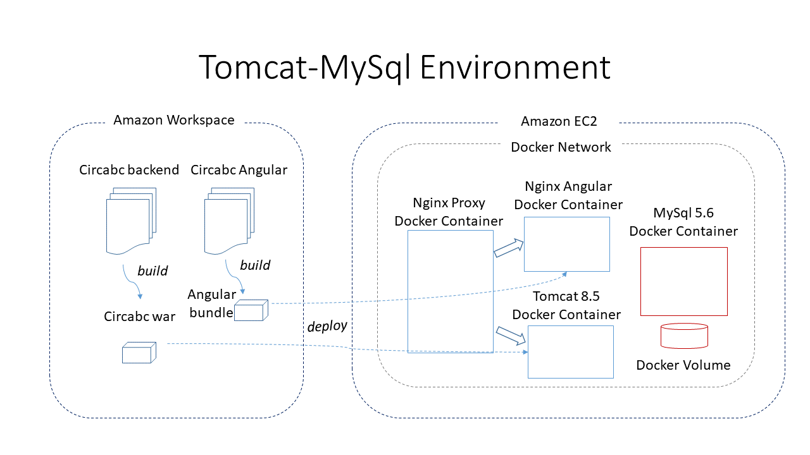

# CIRCABC

This project is a fully open-source release of CIRCABC, based on Alfresco Community Edition 4.2.f, and used by the official CIRCABC website: https://circabc.europa.eu

## Building Circabc Web Application

### Prerequisites

- Install Java JDK 1.8 (required — newer versions are not supported)
  - Set `JAVA_HOME` variable and add `JAVA_HOME/bin` to your `PATH`
  - Recommended: [Eclipse Temurin JDK 8](https://adoptium.net/temurin/releases/?version=8)

- Install Maven 3.6+
  - Set `M2_HOME` variable and add `M2_HOME/bin` to your `PATH`

- Install Node.js 20.x and npm (used by the frontend Maven build)

- Install Docker and Docker Compose

- Download and add `alfresco.war` to `circabc-resources` folder:  
  - Download Alfresco 4.2.f Community Edition from the Alfresco website:  
    (https://download.alfresco.com/release/community/4.2.f-build-00012/alfresco-community-4.2.f.zip)
  - Unzip the `alfresco-community-4.2.f.zip` archive
  - Copy the `alfresco.war` archive (located in `web-server/webapps`) to the `circabc-resources` folder

```bash
mkdir tmp && cd tmp
wget https://download.alfresco.com/release/community/4.2.f-build-00012/alfresco-community-4.2.f.zip
unzip alfresco-community-4.2.f.zip
cp web-server/webapps/alfresco.war ../circabc-resources
cd ..
rm -rf tmp
```

### Repository Initialization

Run a first `mvn clean` to add some missing libraries to your local maven repository:

```bash
mvn clean
```

### Build

Run the following command to build the entire CIRCABC application (frontend and backend):

```bash
mvn clean install -Dbackend-target.env=tomcat-docker -Dfrontend-target.env=docker
```

> **Note:** The build uses `npm install --legacy-peer-deps` for frontend dependencies. This is normal and handles peer dependency conflicts in the Angular project.

## Deploying CIRCABC Web Application in Docker Environment

### Tomcat/MySQL Docker Environment

The aim of this project is to provide an easy-to-install environment for the OSS CIRCABC version.

- This environment contains the following containers:
  - Tomcat 8.5 Docker container running CIRCABC Web Application
  - MySQL 5.6 Database container
  - Angular Nginx container running CIRCABC Angular application
  - Reverse Proxy (Nginx) abstracting the connections to CIRCABC apps to avoid any CORS configuration



Go to the `circabc` root folder and copy the artifacts to the Docker dist folders. (Note that this step can be automated with your CI/CD tools.)

Copy backend and frontend archives to the `circabc-docker` directories:

```bash
rm -rf circabc-docker/tomcat/dist
mkdir -p circabc-docker/tomcat/dist
cp -f circabc-backend/target/circabc.war circabc-docker/tomcat/dist/ROOT.war

rm -rf circabc-docker/angular/dist
mkdir -p circabc-docker/angular/dist/circabc
cp -rf circabc-frontend/dist/circabc/* circabc-docker/angular/dist/circabc/
```

## Running CIRCABC Web Application in Docker Environment

Go to the `circabc-docker` folder.

> **Important:** Make sure ports 80, 3306, and 8443 are not already in use on your system.  
> If port 80 is occupied, you can change it in `circabc-docker/docker-compose-tomcat.yml` (e.g., `7080:80`).

Launch:

```bash
docker compose -f docker-compose-tomcat.yml down 
docker compose -f docker-compose-tomcat.yml up --build
```

> **Note:** The first startup takes 2-3 minutes while Alfresco initializes the database schema.  
> You may see warnings about ImageMagick or pdf2swf not being found — these are optional transformers and can be safely ignored.

## Using CIRCABC Web Application in Docker Environment

### Main CIRCABC Web Application

Connect to the exposed IP of the Nginx container:  
http://localhost/ui/login

You can connect with the following default credentials:

- Default Alfresco admin username/password: `admin/admin`

### Swagger API

You can configure CIRCABC with the REST API using the Swagger UI:  
http://localhost/swagger-ui/index.html

## Creating Sample Users and Data

Optionally, you can launch E2E tests with Cypress to create sample users and data:

1. Install node and npm locally.
2. Install and launch cypress tests:
```bash
cd circabc-e2e
npm install cypress --save-dev
npm run cy:run-oss
```

Then you should be able to connect with any users defined in `circabc-e2e/cypress.config.oss.ts` and browse the sample CIRCABC data:

| Username       | Password    | Role                  |
|----------------|-------------|-----------------------|
| admin          | admin       | Alfresco Admin        |
| circabc_admin  | password    | CIRCABC Admin         |
| IGadmin1       | password123 | Interest Group Admin  |
| Author         | password123 | Author User           |

## Notes

- You cannot run this version in a cluster — only one node can run at a time. Hazelcast is not used as a distributed cache, unlike in Alfresco Enterprise.
- If you want to run an Alfresco instance with multi-store support, you can use the open-source alternative to Alfresco Enterprise:  
  Acosix GitHub project: https://github.com/Acosix/alfresco-simple-content-stores

## License

Copyright European Community —
Licensed under the EUPL V.1.2  
https://interoperable-europe.ec.europa.eu/collection/eupl/eupl-text-eupl-12

This CIRCABC version is entirely based on OSS libraries. It does not rely on any Alfresco Enterprise license.  
Note that Hazelcast cache and other Enterprise features of Alfresco are not available.
