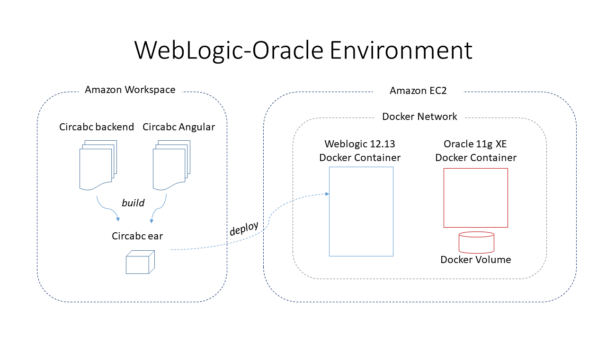

# CIRCABC Docker : Tomcat / MySql / Angular / Nginx Proxy  #

## Introduction ##
The aim of this project is to provide an easy to install environment for OSS CIRCABC version.

- This environment contains the following containers :
   - Tomcat 8.5 Docker container running Circabc Web Application
   - MySQL 5.6 Database container
   - Angular Nginx container running Circabc Angular application
   - Reverse Proxy (Nginx) abstracting the connections to Circabc apps to avoid any Cors config.
- The docker containers run in an Amazon EC2 instance.


## Install Docker ##

- Create an EC2 Linux instance that is only accessible from your Amazon Workspace by SSH or HTTP(S) 
- Install docker in that EC2 instance :
  ```  
    sudo yum update -y
    sudo yum install -y docker
    sudo usermod -aG docker ec2-user
  ``` 
  and start docker service.
    ``` 
    service docker start 
    ````
  
- Install docker-compose in that EC2 instance:
  ```  
    sudo curl -L "https://github.com/docker/compose/releases/download/1.24.0/docker-compose-$(uname -s)-$(uname -m)" -o /usr/local/bin/docker-compose
    sudo chmod +x /usr/local/bin/docker-compose
  ``` 

  


# CIRCABC Docker : WebLogic / Oracle environment #

## Introduction ##
The aim of this project is to provide an easy to install environment for Development and Test of CIRCABC.

- An Oracle 12c database instance and a Weblogic 12.2.1.4 domain each runs in a docker container.  
- The docker containers run in an Amazon EC2 instance.



Docker containers are encapsulated in a private Docker network.  The Oracle container uses a volume for persistance.

## Installation ##

- Create an EC2 Linux instance that is only accessible from your Amazon Workspace by SSH or HTTP(S) 
- Install docker in that EC2 instance :
  ```  
    sudo yum update -y
    sudo yum install -y docker
    sudo usermod -aG docker ec2-user
  ``` 
  and start docker service.
  ``` 
  service docker start 
  ````

  - Install docker-compose in that EC2 instance:
  ```  
    sudo curl -L "https://github.com/docker/compose/releases/download/1.24.0/docker-compose-$(uname -s)-$(uname -m)" -o /usr/local/bin/docker-compose
    sudo chmod +x /usr/local/bin/docker-compose
  ``` 


- Clone the CIRCABC git repository in EC2 :
``` 
git clone https://webgate.ec.europa.eu/CITnet/stash/scm/digitcircabc/circabc.git develop 
```
- go in the docker project : `  cd circabc-docker `
- Pull Weblogic 12.2.1.4  image form Oracle container registry  <br>
(https://container-registry.oracle.com/)

## Usage ##
### Start CIRCABC docker environement ###
Start your environment with docker-compose 
```
 docker-compose -f docker-compose-weblogic.yml up 
```
That's it !!

The weblogic console is available at :
`http://your-ec2-domain/console`

You can get your "your-ec2-domain" by running command :
```
hostname 
```

### License ###
Alfresco license can be updated in the `weblogic/license` directory.
Note that you have to rebuild the WebLogic image if you update the license. 

