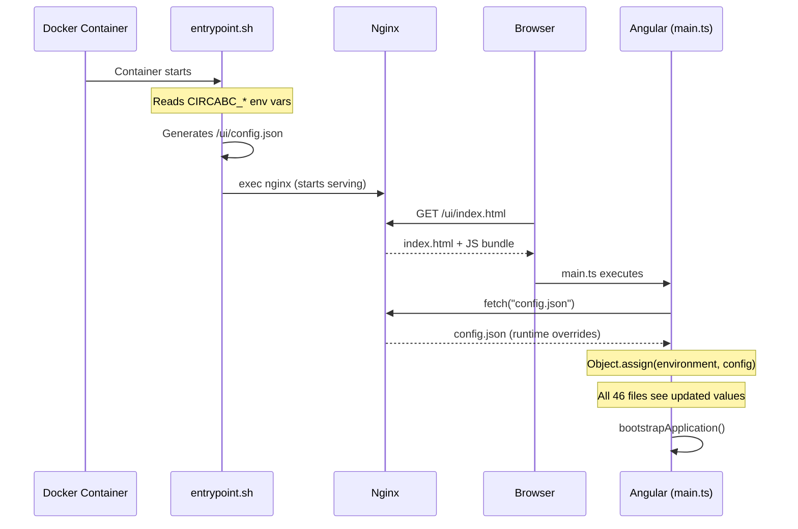
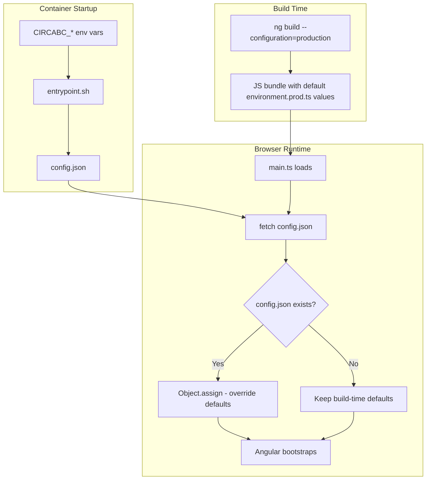

# Frontend Runtime Environment Configuration

## What Changed

### 1. `src/main.ts`
Added a `loadRuntimeConfig()` function that runs before Angular bootstraps. It fetches `config.json` from the app's base href and merges any values found into the `environment` object using `Object.assign()`. Since all 46 files that import `environment` reference the same object in memory, they all see the updated values without any code changes.

If `config.json` doesn't exist (e.g. local dev), the app logs a warning and continues with build-time defaults.

### 2. `docker/entrypoint.sh` (new file)
A shell script that runs at Docker container startup. It reads environment variables prefixed with `CIRCABC_`, maps them to the corresponding `Environment` interface keys, and writes a `config.json` file into the nginx html directory. Only explicitly set env vars are included — unset ones fall back to build-time defaults.

After generating the config, it hands off to nginx via `exec "$@"`.

### 3. `.gitlab-ci.yml` — `docker-build-frontend` job
The inline Dockerfile was updated to:
- Copy `entrypoint.sh` into the image
- Set it as the `ENTRYPOINT` so it runs before nginx starts

### 4. `.gitlab-ci.yml` — `setup-environment` job
Removed the `ENVIRONMENT_TS` file variable handling since frontend config is now provided at runtime, not build time. The `build-frontend` job no longer depends on `setup-environment`.

## Environment Variable Mapping

| Environment Variable | `Environment` Key | Type |
|---|---|---|
| `CIRCABC_PRODUCTION` | `production` | boolean |
| `CIRCABC_ALFRESCO_URL` | `alfrescoURL` | string |
| `CIRCABC_CIRCABC_URL` | `circabcURL` | string |
| `CIRCABC_SERVER_URL` | `serverURL` | string |
| `CIRCABC_ALFRESCO_HOST` | `alfrescoHost` | string |
| `CIRCABC_BASE_HREF` | `baseHref` | string |
| `CIRCABC_NODE_NAME` | `nodeName` | string |
| `CIRCABC_SHOW_UI_SWITCH` | `showUiSwitch` | boolean |
| `CIRCABC_ENVIRONMENT_TYPE` | `environmentType` | string |
| `CIRCABC_CIRCABC_RELEASE` | `circabcRelease` | string |
| `CIRCABC_ARES_BRIDGE_ENABLED` | `aresBridgeEnabled` | boolean |
| `CIRCABC_ARES_BRIDGE_SERVER` | `aresBridgeServer` | string |
| `CIRCABC_ARES_BRIDGE_URL` | `aresBridgeURL` | string |
| `CIRCABC_ARES_BRIDGE_KEY` | `aresBridgeKey` | string |
| `CIRCABC_ARES_BRIDGE_UI_URL` | `aresBridgeUiURL` | string |
| `CIRCABC_ANALYTICS_URL` | `analyticsURL` | string |
| `CIRCABC_ANALYTICS_SITE_ID` | `analyticsSiteId` | string |
| `CIRCABC_ANALYTICS_INSTANCE` | `analyticsInstance` | string |
| `CIRCABC_OFFICE_CLIENT_ID` | `officeClientId` | string |
| `CIRCABC_SHARE_URL` | `shareURL` | string |
| `CIRCABC_CAPTCHA_URL` | `captchaURL` | string |
| `CIRCABC_EULOGIN_URL` | `euloginUrl` | string |
| `CIRCABC_EULOGOUT_URL` | `eulogoutUrl` | string |
| `CIRCABC_USE_ALFRESCO_API` | `useAlfrescoAPI` | boolean |

## How It Works





## Usage

```bash
docker run \
  -e CIRCABC_PRODUCTION=true \
  -e CIRCABC_ENVIRONMENT_TYPE=prod \
  -e CIRCABC_NODE_NAME=N1 \
  -e CIRCABC_EULOGIN_URL=https://ecas.ec.europa.eu/cas/eulogin \
  circabc-frontend:latest
```

Only set the variables you want to override. Everything else uses the defaults baked into `environment.prod.ts` at build time.

## Local Development

No impact. When running `ng serve`, there's no `config.json` — the fetch fails silently and the app uses whichever `environment.*.ts` file is configured for your build target.
